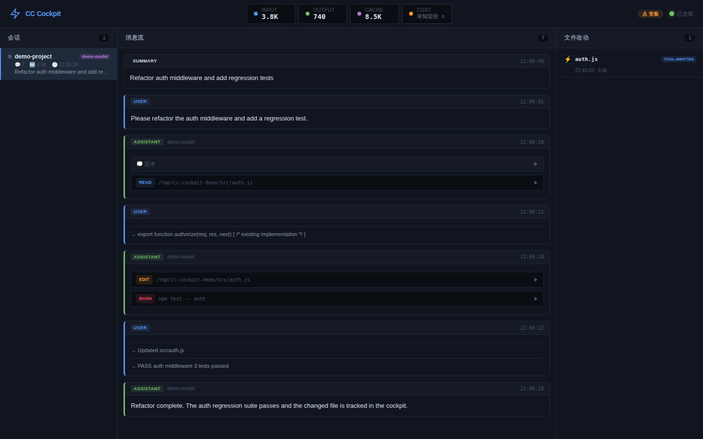
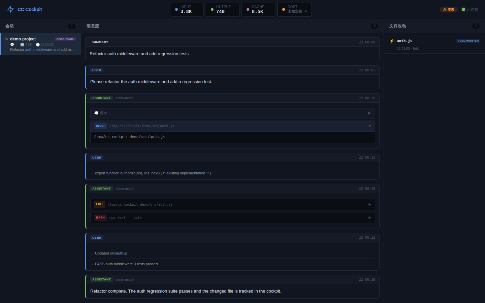
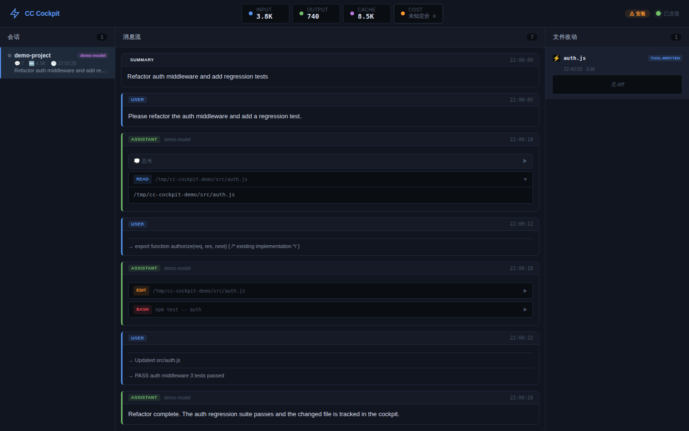
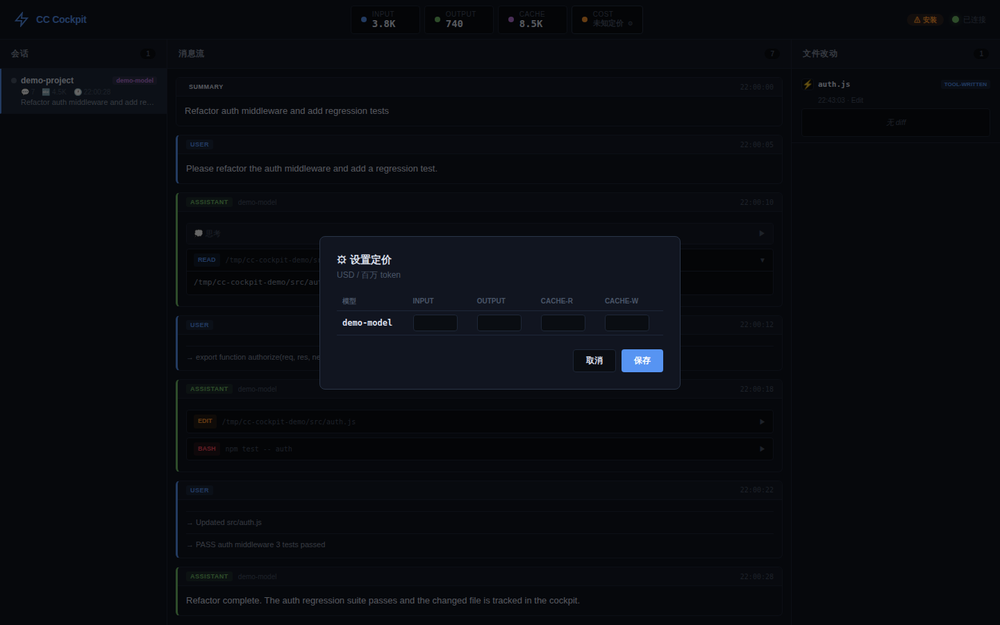

# CC Cockpit / Claude Code 监控驾驶舱

> **Windows 也能用的 Claude Code 实时监控面板** — 看清每轮对话、每次 tool call、每一分钱 token。



[▶ View short demo video (WebM)](./docs/assets/cc-cockpit-demo.webm)

> Demo disclosure: the assets above and below were captured from the **real CC Cockpit runtime and production JSONL parser** using the committed, deterministic, sanitized fixture [`demo/sanitized-session.jsonl`](./demo/sanitized-session.jsonl). They contain synthetic demo content rather than private Claude Code session data.

English | [中文](#中文)

---

## English

### What is CC Cockpit?

A lightweight, zero-build monitoring dashboard for [Claude Code](https://docs.anthropic.com/en/docs/claude-code). Runs on `localhost:3777`, works in any browser.

### Features

| Panel | Description |
|-------|-------------|
| 📋 **Session List** | All active sessions, grouped by project, with status indicators |
| 💬 **Message Flow** | Real-time conversation stream with tool call cards |
| 📁 **File Changes** | Diff view of files modified by Claude Code |
| 💰 **Cost Bar** | Token usage breakdown + USD/CNY cost estimate |

### Quick Start

```bash
# From npm (if published)
npx cc-cockpit

# From GitHub (always available)
npx github:zhangshujuan1314/cc-cockpit
```

Then open http://127.0.0.1:3777 and click "安装 Hooks" for notifications.

### Screenshots

The following screenshots are reproducible publication examples generated by the real app from the sanitized demo fixture; they do not contain private session data.

**Message flow and session overview**


**Tool-call detail**



**File-change panel**



**Cost settings**



### FAQ

**Q: Is my data sent anywhere?**
A: No. Everything runs on `127.0.0.1` only. No external API calls, no telemetry.

**Q: Can others on my network access the dashboard?**
A: No. The server binds to `127.0.0.1` only — LAN access is rejected.

**Q: How do I set pricing for my model?**
A: Click the "未知定价 ⚙️" button in the cost bar, enter your provider's rates, and save. Prices are stored in `pricing.json`.

---

## 中文

### 这是什么？

Claude Code 的轻量级实时监控面板。零构建、纯浏览器访问，运行在 `localhost:3777`。

### 四面板功能

| 面板 | 说明 |
|------|------|
| 📋 **会话列表** | 按项目分组，显示运行状态、消息数、token 用量 |
| 💬 **实时对话流** | 消息卡片流，tool call 可折叠，sidechain 自动分组 |
| 📁 **文件改动** | diff 红绿高亮，tool call 直接写入的文件带 ⚡ 标记 |
| 💰 **成本条** | IN/OUT/Cache 分列 + 双币显示（USD/CNY）+ 超阈值警告 |

### 快速开始

```bash
# npm 安装
npx cc-cockpit

# GitHub 安装（始终可用）
npx github:zhangshujuan1314/cc-cockpit
```

浏览器打开 http://127.0.0.1:3777，点击「安装 Hooks」开启通知。

### 自定义定价

1. 点击顶栏的「未知定价 ⚙️」按钮
2. 输入你的服务商实际价格（USD / 百万 token）
3. 点击保存，价格持久化到 `pricing.json`

### 截图

以下素材由**真实 CC Cockpit 服务和正式 JSONL 解析链路**读取公开的脱敏演示数据自动生成，不包含私人 Claude Code 会话内容。

**会话与消息流**


**Tool Call 展开**


**文件改动面板**


**成本设置**


### FAQ

**Q: 数据会发到外部吗？**
A: 不会。全程 `127.0.0.1`，无外部 API 调用，无遥测。

**Q: 局域网其他人能访问吗？**
A: 不能。服务只绑定 `127.0.0.1`，局域网访问会被拒绝。

**Q: 如何设置模型定价？**
A: 点击成本条的「未知定价 ⚙️」，输入服务商价格，保存即可。

---

## License

MIT
